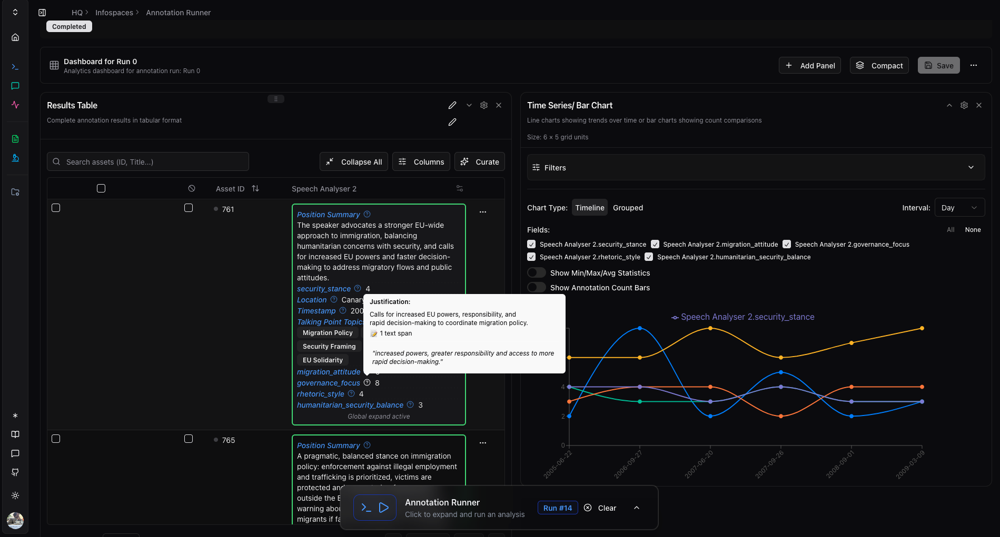
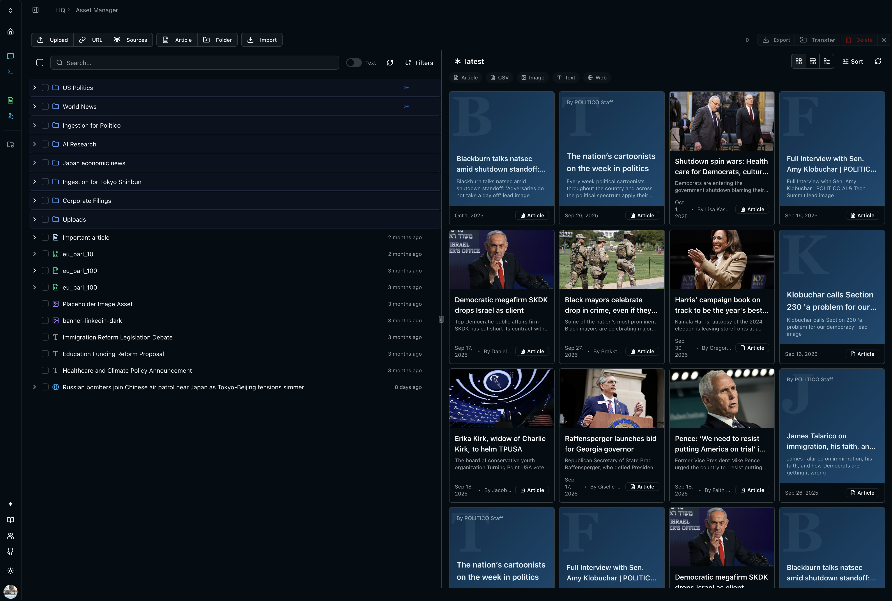
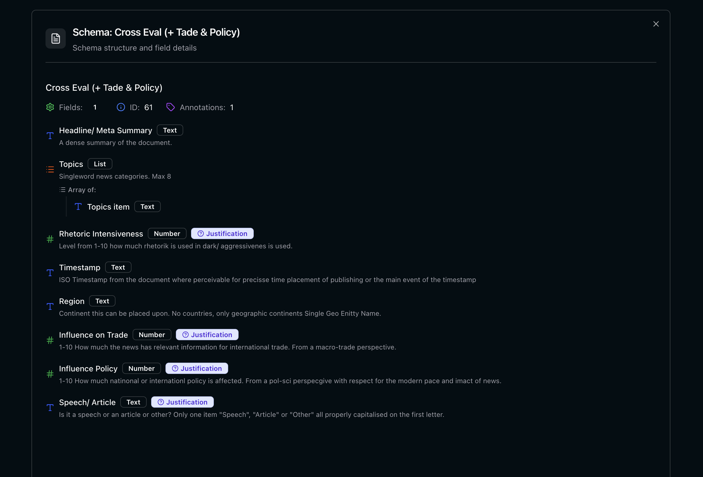
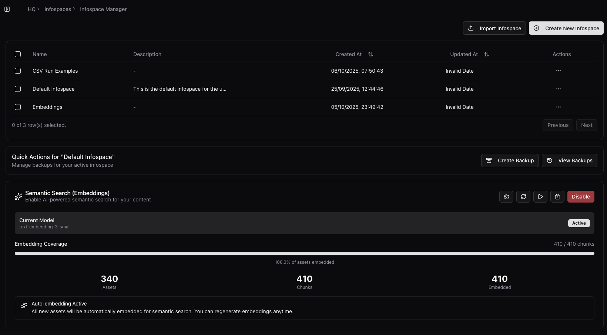

# 🌐 Open Politics HQ

> Open Source Intelligence Platform


---

**Talk: Open Source Political Intelligence** @ CCCB Datengarten  
[🎥 Watch Presentation](https://media.ccc.de/v/dg-111)

<div align="center">
  
</div>


**The modern information landscape is a chaotic mess and, most often, difficult to navigate.**

Maybe you need to prove a point, are aiming to dive deeper into a topic, or simply want to understand what's happening. Whether you're an organisation drowning in unstructured data, an NGO with not enough hands on deck, an independent journalist tracking patterns across hundreds of sources, a researcher needing systematic analysis tools, or a business struggling with process inefficiencies, this is for you.

## The Idea

A journalist knows how to identify "security framing" in news coverage. A policy analyst knows what counts as "meaningful stakeholder engagement" in legislative proposals. A bureaucrat knows whether a grant application is properly filled out.

That expertise lives in their heads, maybe in spreadsheets and notes. This works great for tens of documents. At hundreds or thousands, you're either stuck or you need to hire engineers. Meanwhile, sophisticated analysis infrastructure — the kind that lets you systematically apply analytical frameworks at scale — has only been available to well-funded institutions.

**Thus HQ:** define your analytical questions in plain language. Apply them at scale. Your schemas are your "lenses" you use to see the data. They are shareable, transparent, and improvable. Other researchers can see exactly how you defined your framework, critique it, refine it, or apply it to their own data.

**For example:** Imagine as a journalist, you are analysing 200 news articles. You create a schema:

```
Primary source cited? → [government, activist, expert, anonymous]
Emotional intensity?  → 1-5
Which side gets final word? → string

# + your specific definitions of "emotional intesity"
# Your description becomes your method, you can measure and evolve it. 
```





**Run it. Get structured data showing systematic patterns. Export visualizations.**

The principle scales. A journalist knows "framing." A policy analyst knows "stakeholder engagement." An NGO worker knows what signals a policy shift. Schemas let you take that knowledge and apply it systematically across thousands of documents. The same infrastructure that analyses legislation can sort emails, process intake forms, track regulatory changes, or monitor media coverage.

This capability shouldn't be locked behind institutional walls. We're building it as **public infrastructure**: schemas, geocoding, vector search, local AI. Basic components, simple when you list them out. But that's the point. These are basic intelligence capabilities an open society needs, like libraries or archives, and they should be equally accessible.

Open source. Self hostable. Bring your own LLM keys if you want privacy. Share your analytical frameworks publicly if you want transparency. Use it for journalism, research, advocacy, governance, anything that serves the public interest.

Importantly: none of this would exist without the many people dedicated to open source. We're assembling the hard work of countless other projects. We are standing on the shoulders of a massive collaborative ecosystem that makes this possible. We are grateful for their work and we are proud to be part of it.


https://github.com/user-attachments/assets/60b8fa3f-d5ba-4928-a65c-121ba670e160


## How It Works

1. **Ingest content** from files, URLs, search results, RSS feeds


2. **Define schemas** that describe what information to extract
3. **Run analysis** using AI to apply your schema at scale
4. **Explore results** through tables, visualizations, maps, or export the data


**Supported formats:** PDFs, web articles, text, CSV, RSS feeds  
**Coming soon:** Images, audio, email inbox ingestion


The schemas are the key innovation. They let you formalize your analytical method in natural language, making qualitative approaches reproducible and transparent. Other researchers can see exactly how you defined "populist rhetoric" or "security framing" and apply the same lens to their data.



## Chat & MCP

https://github.com/user-attachments/assets/978cf874-5476-4d78-85e6-4485678e1dcc

The **Chat & MCP (Model Context Protocol)** centralizes all platform tools (asset management, schema based analysis, vector search, content ingestion) into a unified analysis access point that lets you work with structured analytical methods through conversational AI. This combination allows for various workflows for researching & synthesizing data. Editing MCP configs (upcoming on a per user level) furthermore allows you to grant your LLM access to almost arbitrary outside data and use it for your analysis.

## Infospaces & Vector Storage

Your assets, schemas and analysis results are scoped to "Information Spaces" that you can use to curate information. 
Each Information Space is a dedicated vector space. Use vector embeddings from local or cloud models to search through your data, cluster it (upcoming) and find duplicates.



## Links

- **[Webapp](https://open-politics.org)** — hosted instance (public registration opening soon)
- **[Documentation](https://docs.open-politics.org)** — user guides and tutorials
- **[Forum](https://forum.open-politics.org)** — community discussions

## Getting Started

### Option 1: Use the Hosted Instance

The easiest way to start. We host the infrastructure, you bring your own LLM API keys ([see supported providers](#llm-support)).

1. **Register** at [open-politics.org/accounts/register](https://open-politics.org/accounts/register)
2. **Add your API keys** on the home page
3. **Start analysing** — upload content and create your first schema

> Your account also works on the [forum](https://forum.open-politics.org) for community support.

### Option 2: Self-Host with Docker

For privacy, customization, or institutional requirements. Run everything on your own infrastructure.

**Minimum requirements:** 8GB RAM, 4 CPU cores, 300GB disk (primarily for Nominatim geocoding database; ~30GB without it).

```bash
git clone https://github.com/open-politics/open-politics-hq.git
cd open-politics-hq
bash prepare.sh
cp .env.example .env
# Edit .env with your configuration
docker compose up
```

Default admin credentials (change these):
```bash
FIRST_SUPERUSER=app_user
FIRST_SUPERUSER_PASSWORD=app_user_password
```


### Deployment Flexibility

**Fully Local:** Run everything on your own hardware. Good for air-gapped environments or complete data control.

**Hybrid:** Run the application locally but use managed services (AWS RDS, Upstash Redis, S3) to reduce operational burden.

**Kubernetes:** We provide a Helm chart at [`.deployments/kubernetes/open-politics-hq-deployment`](.deployments/)


## Architecture

The platform is built from several independent services that work together. You can run them all locally or mix local and managed services.

### Core Components

| Component | What It Does | Technology |
|-----------|-------------|------------|
| **Backend** | API, analysis jobs, MCP server | FastAPI + Python |
| **Frontend** | Web interface | Next.js + React |
| **Worker** | Background processing for large jobs | Celery |
| **Database** | Data storage with vector search | PostgreSQL + PGVector |
| **Object Storage** | File storage for uploads | MinIO (S3-compatible) |
| **Cache/Queue** | Session management, job queues | Redis |
| **Geocoding** | Location extraction and mapping | Pelias |
| **LLM** (optional) | Local AI inference | Ollama |

### LLM Support

Connect any of these AI providers:
- **Anthropic** (Claude Sonnet 4.5, etc.)
- **OpenAI** (GPT-5 etc.)
- **Google** (Gemini models)
- **Ollama** (run models locally — Llama, OAI OSS, Qwen, etc.)

Configure API keys in the web interface or run Ollama locally for complete privacy.

## Contributing

We're building this in the open. The codebase, analytical methods, and documentation are all public and improvable.

**Ways to contribute:**
- Report bugs or suggest features (GitHub Issues)
- Improve documentation or add examples
- Build and share analytical schemas
- Contribute code (see backend and frontend READMEs)
- Join community discussions on the forum

## Contact & Community

- **Email:** engage@open-politics.org
- **Forum:** [forum.open-politics.org](https://forum.open-politics.org)
- **Dev Meetings:** Wednesdays 15:30 Berlin Time

## License

AGPLv3 — see [LICENSE](LICENSE)

This means you can use, modify, and distribute this software, but any modifications or services built on it must also be open source. You can get an enterprise license for private use modifications which are not publicly deployed for one year at a time under strict ethical guidelines.


## Project Origins & Story

This project started at Freie Universität Berlin's Political Science department. The gap between what research infrastructure could theoretically do and what was practically accessible to most researchers was obvious. Someone had to build the bridge. Our first official funding came from the European Horizon NGI Search project, and before that we were lucky to have a warm circle of friends and early supporters who believed in the idea before there was much to show. No venture capital, just journalists and neighbours who got it.

The business model is intentionally simple: we'll try to keep a free hosted version running as much as we can shoulder, but hosting HQ is rather cheap as most of the cost comes from LLMs. We focus on helping organisations deploy and use the platform effectively: infrastructure orchestration, custom implementations, training. The platform itself always stays open source and self hostable.

Our marketing is the research that gets done with these tools. If people publish interesting work using HQ, that's worth more than any advertising campaign.

If you want to support this mission or just talk about what you're building, reach out: engage@open-politics.org
