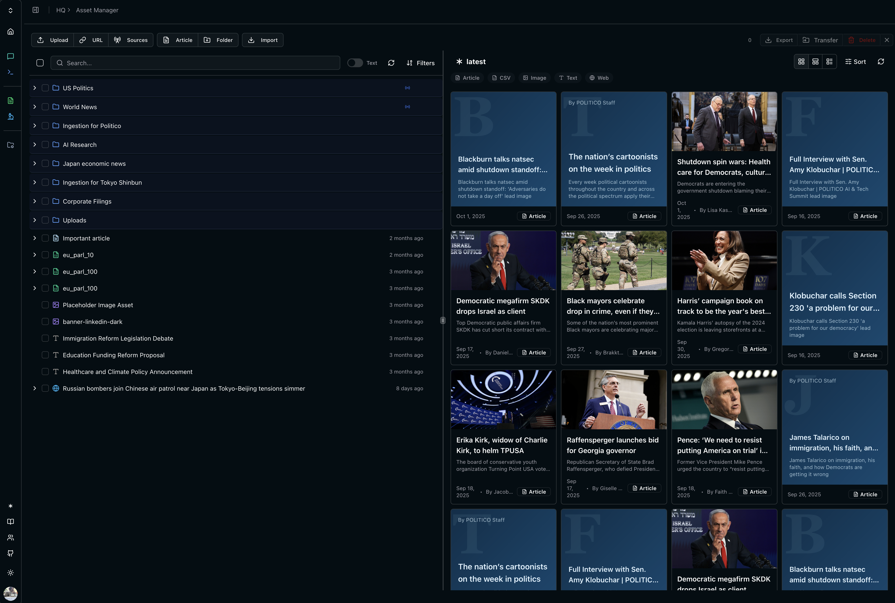
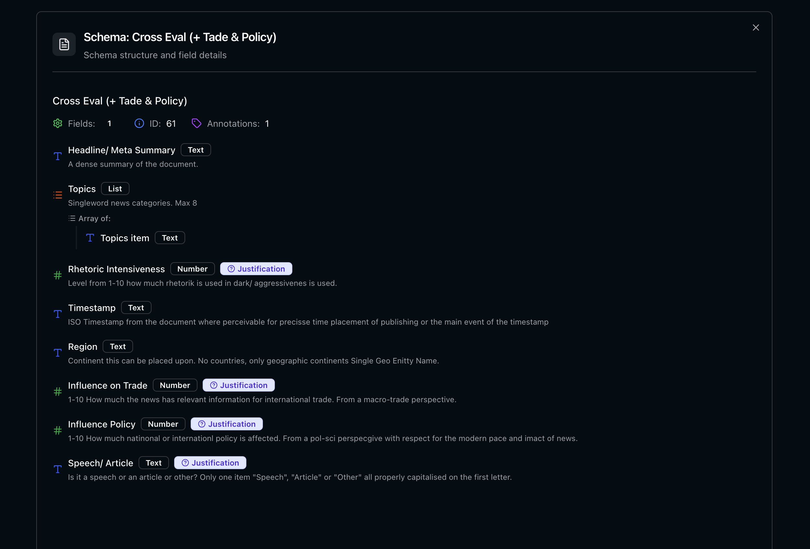
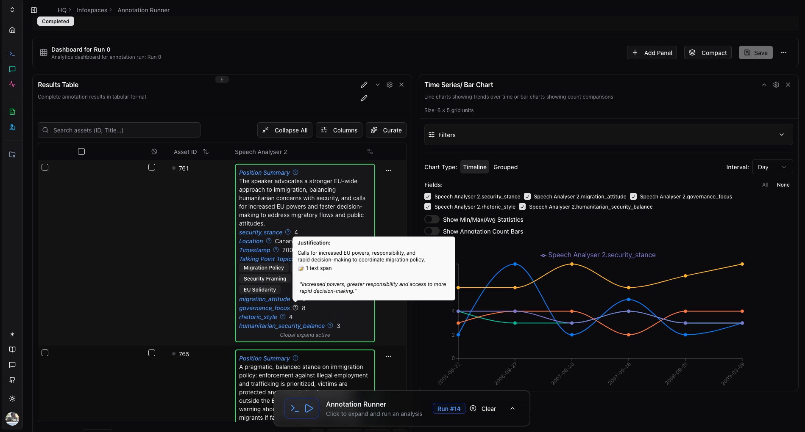

# Open Politics HQ

A workspace for material you have more of than you can read.

[Docs](https://docs.open-politics.org) · [Webapp](https://open-politics.org) · [Forum](https://forum.open-politics.org)

<div align="center">
  
</div>

You point HQ at documents, uploads, RSS feeds, search results, a directory nobody has opened since 2019, and it takes them in, pulls them apart into something addressable (a PDF into its pages, a CSV into its rows) and keeps them somewhere you can search, organise and come back to.

The part that does the actual work is annotation. You write down what you're looking for as questions with defined answers, roughly the way you'd write a codebook, and the system applies that across everything you point it at, whether that's twelve documents or forty thousand. What comes back is structured: a row per document, a column per question, and every value carrying a link back to the passage it was taken from. From there it's tables, charts, maps, entity graphs, or an export you take somewhere else entirely.

Self-hostable with Docker Compose or Kubernetes. Works against Anthropic, OpenAI, Google or a local Ollama, so it runs the same on a server as it does on a laptop with the network off. AGPLv3.





## Schemas

The unit of work is a schema: your question, written in plain language, with the shape of the answer pinned down so the results are comparable across everything you run it on.

**Analysing news coverage**
```
Primary source cited? → [government, activist, expert, anonymous]
Emotional intensity?  → 1-5
Which side gets final word? → string
```

**Extracting invoice data**
```
Invoice number? → string
Total amount? → number
Date? → date
Vendor name? → string
```

**Sorting through old files**
```
Document type? → [contract, correspondence, report, other]
Date range? → [pre-2020, 2020-2022, post-2022]
Relevance? → [critical, important, archive]
```

Because a schema is just text, it travels. Somebody else can read exactly how you defined your categories, disagree with them, change them, or run them against their own material and see whether your finding holds.

## Concepts

**Infospaces** are workspaces that keep projects apart. Each one has its own vector index for semantic search, and it's the unit you export, back up or share.

Inside an infospace:

- **Assets** — your material. PDFs, CSVs, articles, feeds. They nest: a PDF becomes pages, a CSV becomes rows, so you can annotate at whatever granularity the question needs.
- **Bundles** — directories. An asset can live in several at once.
- **Schemas** — your questions, in natural language, with strict output definitions.
- **Analysis** — running schemas over assets, which produces annotations.
- **Dashboards** — tables, charts, maps and graphs over the results. Export or share them.
- **Chat** — an assistant with access to the same primitives, for when you'd rather ask than click.

```
Infospace
├── Assets (PDFs, CSVs, articles, feeds)
├── Bundles (folders for organization)
├── Schemas (analytical questions)
└── Analysis → Annotations → Dashboards
```

See the [overview](https://docs.open-politics.org/pages/app/overview) for the longer version.

## Quickstart

**Minimum requirements:** 8GB RAM, 4 CPU cores, 300GB disk (mostly for the Nominatim geocoding database; ~30GB without it).

```bash
git clone https://github.com/open-politics/open-politics-hq.git
cd open-politics-hq
./setup.sh
```

`setup.sh` is the single entrypoint. Run with no arguments it opens an
interactive **dashboard**: it shows current state (environment, profiles,
workers, secret/placeholder status, running services) and offers menu options
to set up, start, stop, restart, rotate secrets, and view logs — no flags
needed. It generates `.env` with strong secrets, creates `.store/` with correct
permissions, and lets you pick a deployment preset (`dev`, `production`,
`local-ollama`, `local-geocoder`, `searxng` — additive). Re-running is always
safe: existing secrets and data are never overwritten.

Flags exist for automation/CI:

```bash
./setup.sh --preset dev -y           # lean dev, no prompts
./setup.sh --preset production --preset local-ollama
./setup.sh rotate --fernet           # rotate the encryption key safely
./setup.sh --help
```

For the hosted option, Kubernetes, or hybrid setups, see the [installation guide](https://docs.open-politics.org/pages/app/installation-self-hosted).

## Architecture

| Component | Purpose |
|-----------|---------|
| Backend | API, analysis jobs, MCP server — FastAPI + Python |
| Frontend | Web interface — Next.js + React |
| Worker | Background processing for large jobs — Celery |
| Database | Data storage with vector search — PostgreSQL + pgvector |
| Object Storage | File storage for uploads — MinIO (S3-compatible) |
| Cache/Queue | Session management, job queues — Redis |
| Geocoding | Location extraction and mapping — Nominatim |
| LLM (optional) | Local AI inference — Ollama |

Model providers are swappable: Anthropic, OpenAI, Google, or Ollama running locally. Keys go in through the web interface, or you skip them entirely and keep everything on your own hardware.

For deployment options (hosted, Kubernetes, hybrid), see the [installation guide](https://docs.open-politics.org/pages/app/installation-self-hosted) or have a look at the [deployment options](.deployments).

## Development

`backend/README.md` and `frontend/README.md` have the respective development guides (work in progress).

## Contributing

Built in the open, and we'd rather hear where it's wrong than not. See the [docs](https://docs.open-politics.org/pages/project/manifest#contact--contributing) or open an issue.

## License
AGPLv3 - see [LICENSE](LICENSE) \
Use, modify, distribute freely. Services built on it must also be open source. Enterprise licenses available for private modifications under strict ethical guidelines.

## Contact

**Email:** engage@open-politics.org  
**Forum:** [forum.open-politics.org](https://forum.open-politics.org)
