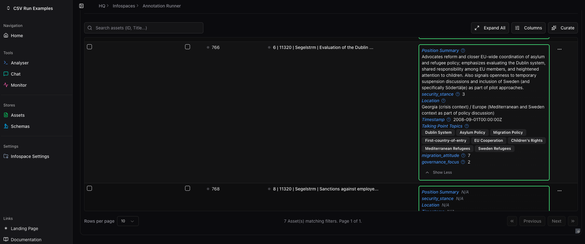

# 🌐 Open Politics HQ

> ** Open Source Multi-Purpose Intelligence Platform **


---

**Talk: Open Source Political Intelligence** @ CCCB Datengarten  
[🎥 Watch Presentation](https://media.ccc.de/v/dg-111)

<div align="center">
  
</div>


The modern information landscape is chaotic and difficult to navigate. Whether you need to prove a point, dive deeper into a topic, or simply understand what's happening, the challenge is the same: making sense of vast amounts of unstructured information. This platform serves students seeking better research tools, organizations drowning in unstructured data, NGOs overwhelmed by document management, and businesses struggling with process inefficiencies.

## The Idea

A journalist knows how to identify "security framing" in news coverage. A policy analyst knows what counts as "meaningful stakeholder engagement" in legislative proposals. A bureaucrat knows whether a grant application is properly filled out.

That expertise lives in their heads, maybe in spreadsheets and notes. This works great for tens of documents. At hundreds or thousands, you're either stuck or you need to hire engineers. Meanwhile, sophisticated analysis infrastructure — the kind that lets you systematically apply analytical frameworks at scale — has only been available to well-funded institutions.

**HQ.** Define your analytical questions in plain language. Apply them at scale. The key innovation: schemas are shareable, transparent, and improvable. Other researchers can see exactly how you defined your framework, critique it, refine it, or apply it to their own data.

**For example:** Imagine as a journalist, you are analyzing 200 news articles. You create a schema:

```
Primary source cited? → [government, activist, expert, anonymous]
Emotional intensity?  → 1-5
Which side gets final word? → string

# + your specific definitions of "emotional intesity"
# Your description becomes your method, you can measure and evolve it. 
```



Run it. Get structured data showing systematic patterns. Export visualizations.

The principle scales. A journalist knows "framing." A policy analyst knows "stakeholder engagement." An NGO worker knows what signals a policy shift. Schemas let you take that knowledge and apply it systematically across thousands of documents. The same infrastructure that analyzes legislation can sort emails, process intake forms, track regulatory changes, or monitor media coverage.

This capability shouldn't be locked behind institutional walls. We're building it as **public infrastructure** — schemas, geocoding, vector search, local AI. Basic components, simple when you list them out. But that's the point. These are basic intelligence capabilities an open society needs, like libraries or archives, and they should be equally accessible.

Open source. Self-hostable. Bring your own LLM keys if you want privacy. Share your analytical frameworks publicly if you want transparency. Use it for journalism, research, advocacy, governance — anything that serves the public interest.

Importantly: none of this would exist without the many people dedicated to open source. We're assembling the hard work of countless other projects. We are standing on the shoulders of a massive collaborative ecosystem that makes this possible. We are grateful for their work and we are proud to be part of it.


https://github.com/user-attachments/assets/60b8fa3f-d5ba-4928-a65c-121ba670e160


## How It Works

1. **Ingest content** from files, URLs, search results, RSS feeds
2. **Define schemas** that describe what information to extract
3. **Run analysis** using AI to apply your schema at scale
4. **Explore results** through tables, visualizations, maps, or export the data

The schemas are the key innovation. They let you formalize your analytical method in natural language, making qualitative approaches reproducible and transparent. Other researchers can see exactly how you defined "populist rhetoric" or "security framing" and apply the same lens to their data.


https://github.com/user-attachments/assets/978cf874-5476-4d78-85e6-4485678e1dcc


## Links

- **[Webapp](https://open-politics.org)** — hosted instance (public registration opening soon)
- **[Documentation](https://docs.open-politics.org)** — user guides and tutorials
- **[Forum](https://forum.open-politics.org)** — community discussions

## Getting Started

### Option 1: Use the Hosted Instance

The easiest way to start. We host the infrastructure, you bring your own LLM API keys ([see supported providers](#llm-support)).

1. **Register** at [open-politics.org/accounts/register](https://open-politics.org/accounts/register)
2. **Add your API keys** on the home page
3. **Start uploading content** and creating schemas

> Your account also works on the [forum](https://forum.open-politics.org) for community support.

### Option 2: Self-Host with Docker

For privacy, customization, or institutional requirements. Run everything on your own infrastructure.

```bash
git clone https://github.com/open-politics/open-politics-hq.git
cd open-politics-hq
bash prepare.sh
cp .env.example .env
# Edit .env with your configuration
docker compose up
```

Default admin credentials (change these):
```bash
FIRST_SUPERUSER=app_user
FIRST_SUPERUSER_PASSWORD=app_user_password
```

You can run fully local (including Ollama for LLMs) or use a hybrid setup with managed services for PostgreSQL, Redis, and object storage.


## Architecture

The platform is built from several independent services that work together. You can run them all locally or mix local and managed services.

### Core Components

| Component | What It Does | Technology |
|-----------|-------------|------------|
| **Backend** | API, analysis jobs, MCP server | FastAPI + Python |
| **Frontend** | Web interface | Next.js + React |
| **Worker** | Background processing for large jobs | Celery |
| **Database** | Data storage with vector search | PostgreSQL + PGVector |
| **Object Storage** | File storage for uploads | MinIO (S3-compatible) |
| **Cache/Queue** | Session management, job queues | Redis |
| **Geocoding** | Location extraction and mapping | Pelias |
| **LLM** (optional) | Local AI inference | Ollama |

### Deployment Flexibility

**Fully Local:** Run everything on your own hardware. Good for air-gapped environments or complete data control.

**Hybrid:** Run the application locally but use managed services (AWS RDS, Upstash Redis, S3) to reduce operational burden.

**Kubernetes:** We provide a Helm chart at [`.deployments/kubernetes/open-politics-hq-deployment`](.deployments/kubernetes/open-politics-hq-deployment)

### LLM Support

Connect any of these AI providers:
- **Anthropic** (Claude, etc.)
- **OpenAI** (GPT-4, GPT-4o, etc.)
- **Google** (Gemini models)
- **Ollama** (run models locally — Llama, Mistral, etc.)

Configure API keys in the web interface or run Ollama locally for complete privacy.


## Who This Is For

- **Journalists** investigating patterns across large document sets
- **Researchers** applying qualitative methods at quantitative scale
- **NGOs and advocacy groups** tracking policy developments
- **Students** learning research methods with real-world data
- **Citizens** who want sophisticated tools for understanding politics

And yes.. also many businesses as the general principle applies to many processes and workflows needed by companies (customer support, sales, marketing, etc.). 

The idea of this HQ is what you make of it.

## Examples in Practice

**📰 Media Bias Analysis**  
Journalist analyzes 200 articles. Schema extracts: primary source type, emotional intensity (1-5), headline framing. Result: Chart comparing systematic patterns across outlets.

**💬 Customer Support Automation**  
Small business processes 500 tickets (CSV/email). Schema: issue category, sentiment, urgency flag, mentioned features. Result: Auto-routing + trend analysis.

**🗺️ Geographic News Mapping**  
Citizen tracks local infrastructure coverage. Schema extracts: location (geocoded), project type, status, sentiment. Result: Interactive map color-coded by coverage tone.

**🎤 Interview Transcript Coding**  
Researcher codes 40 transcripts. Schema: trust level, institutions mentioned, framing, key themes. Result: Structured dataset ready for analysis in hours, not weeks.

**📋 Grant Application Screening**  
NGO reviews 100 applications (PDFs). Schema: sections complete, budget clarity, mission alignment, requested amount. Result: Quick filtering to focus review time.

**📊 Policy Monitoring**  
Advocacy group tracks legislation (RSS/web). Schema: policy area, stance, urgency indicators, sponsors. Result: Dashboard with alerts when relevant bills advance.

---

**Supported formats:** PDFs, web articles, text, CSV, RSS feeds  
**Coming soon:** Images, audio, email ingestion

## Contributing

We're building this in the open. The codebase, analytical methods, and documentation are all public and improvable.

**Ways to contribute:**
- Report bugs or suggest features (GitHub Issues)
- Improve documentation or add examples
- Build and share analytical schemas
- Contribute code (see backend and frontend READMEs)
- Join community discussions on the forum

## Contact & Community

- **Email:** engage@open-politics.org
- **Forum:** [forum.open-politics.org](https://forum.open-politics.org)
- **Dev Meetings:** Wednesdays 15:30 Berlin Time

## License

AGPLv3 — see [LICENSE](LICENSE)

This means you can use, modify, and distribute this software, but any modifications or services built on it must also be open source. You can get an enterprise license for private use modifications which are not publicly deployed for one year at a time under strict ethical guidelines.


## Project Origins & Story

This project started at Freie Universität Berlin's Political Science department, born from a student's frustration with the disconnect of theoretically available tools and the practical ones available. Our first official funding came from the European Horizon NGI Search project, and before that we were lucky to have a warm circle of friends and early supporters who believed in the idea before there was much to show.

The business model is intentionally simple: we'll try to keep a free hosted version running as much as we can shoulder, but hosting HQ is rather cheap as most of the cost comes from LLMs. We focus on helping organizations deploy and use the platform effectively — infrastructure orchestration, custom implementations, training. The platform itself always stays open source and self-hostable. 

Our "marketing" is the research that gets done with these tools. If people publish interesting work using HQ, that's worth more than any advertising campaign.

If you want to support this mission or just talk about what you're building, reach out: engage@open-politics.org
