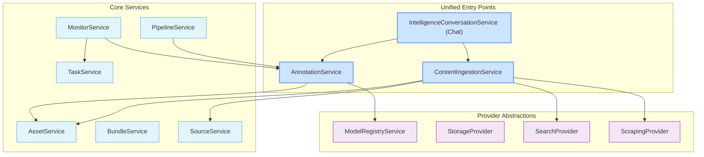

## System Architecture Guide

> **Status:** ✅ **Current & Accurate**  
> **Purpose:** Canonical overview of the backend architecture, core concepts, and development patterns.

---

### Core Philosophy

The platform is designed to perform **qualitative research at a quantitative scale**. It operationalizes complex, human-centric analysis into reproducible, automated workflows.

**Core Principles:**
- **Auditability & Reproducibility**: All analysis is traceable through immutable `AnnotationRun` records.
- **Composition**: Services are decoupled and chainable, enabling complex workflows.
- **Schema-Driven**: `AnnotationSchema` (JSON Schema + instructions) provides a structured contract for all AI analysis.
- **Asynchronous by Default**: Heavy operations (ingestion, analysis) are handled by background tasks for resilience and scalability.

---

### Core Data Model & Workflow

The fundamental workflow transforms unstructured content into structured, curated intelligence.

```mermaid
flowchart TD
    subgraph Ingestion["1. Content Ingestion"]
        A["Locator (URL, File, Query)"] --> B[ContentIngestionService];
        B --> C[Asset Creation & Processing];
    end
    
    subgraph Analysis["2. Analysis & Annotation"]
        D["AnnotationSchema (The 'How')"] --> E[AnnotationRun];
        C --> E["Asset(s) (The 'What')"];
        E --> F[Annotation (Structured Result)];
    end
    
    subgraph Curation["3. Curation & Intelligence"]
        F --> G[Justification (The 'Why')];
        F --> H[Intelligence Fragments];
        H --> C;
    end
```

**Key Entities:**

- **Infospace**: The top-level tenant boundary. Owns all data.
- **Asset**: An immutable record of content (e.g., a PDF, a web page, a CSV row). Assets can have parent-child relationships (e.g., a PDF parent with page children).
- **Bundle**: A mutable, named collection of Assets. Used for organizing data and as inputs for automated workflows.
- **AnnotationSchema**: The blueprint for an analysis task, defining the desired JSON output and providing natural language instructions for the AI.
- **AnnotationRun**: An immutable record of executing one or more `AnnotationSchemas` against a set of target `Assets`. It is the core unit of auditability.
- **Annotation**: The structured data result of applying one `Schema` to one `Asset` within one `Run`.
- **Justification**: An optional record linked to an `Annotation` that captures the AI's reasoning and the specific evidence (text spans, image regions) used.
- **Intelligence Fragment**: A curated piece of intelligence promoted from an `Annotation` and stored directly on an `Asset`'s metadata for durable, queryable access.

---

### Service Layer Architecture

The backend follows a service-oriented architecture with clear responsibilities.



**Primary Services:**

-   **`ContentIngestionService`**: The **single entry point** for all content. It handles discovery (from search, URLs, RSS), ingestion (files, text), and processing (scraping, PDF parsing), creating the corresponding `Asset` records.
-   **`AnnotationService`**: Manages all AI analysis. It creates `AnnotationRun`s, processes them via the `ModelRegistryService`, and stores the resulting `Annotation`s and `Justification`s. It also handles result aggregation.
-   **`IntelligenceConversationService`**: Powers the chat interface. It orchestrates tool calls, delegating actions like searching or analyzing to the `ContentIngestionService` and `AnnotationService`.
-   **`AssetService`**: Handles the fundamental CRUD (Create, Read, Update, Delete) operations for `Asset` models.
-   **`SourceService`**: Manages `Source` configurations, which are essentially saved ingestion recipes (e.g., an RSS feed URL) that can be run on a schedule by a `Task`.
-   **`MonitorService` & `PipelineService`**: Orchestrate automated, multi-step intelligence workflows.
-   **`ModelRegistryService`**: A unified interface to all configured language model providers (OpenAI, Gemini, Ollama), handling dynamic model discovery and routing requests.

---

### Automation Patterns

-   **Tasks (`TaskService`)**: The fundamental scheduling mechanism, powered by Celery Beat. A `Task` runs on a cron schedule.
    -   **INGEST Task**: Executes a saved `Source` configuration to discover new assets.
    -   **MONITOR Task**: Executes a `Monitor` to analyze new assets.
-   **Monitors (`MonitorService`)**: A simple, continuous automation pattern. It watches `Bundle`(s) and automatically creates an `AnnotationRun` to analyze any *new* assets that appear.
-   **Pipelines (`PipelineService`)**: A more complex, multi-stage workflow engine. Pipelines can chain steps like `ANNOTATE` -> `FILTER` -> `ANALYZE` -> `BUNDLE` to create sophisticated, conditional analysis workflows.

---

### Performance & Scalability Patterns

The service architecture is designed for high performance and scalability, incorporating several key patterns:

-   **Provider Caching**: In asynchronous contexts like Celery tasks, provider instances (for Storage and AI Models) are cached at the worker level. This eliminates redundant and slow initializations (e.g., SSL handshakes, authentication) for tasks executing within the same worker process, dramatically reducing overhead on multi-asset runs.

-   **Data Pre-fetching & Batching**: For operations involving multiple assets or schemas (like `AnnotationRun`), all required data is pre-fetched in a single batch. Schemas are validated and compiled once per run, and all target assets are retrieved from the database upfront, minimizing DB queries inside processing loops.

-   **Concurrent Processing**: Where applicable, tasks are executed in parallel using `asyncio.gather`. Concurrency is managed by a semaphore to respect external API rate limits and control system load, ensuring high throughput without overwhelming downstream services.

-   **Asynchronous Operations**: All potentially long-running operations, especially I/O-bound tasks like content scraping or file storage, are handled asynchronously, either in API routes or dedicated background tasks, ensuring the application remains responsive.

---

### Development & Extension

-   **Adding a New Content Source**: Extend `ContentIngestionService` with a new handler for your locator type (e.g., a social media feed).
-   **Adding a New AI Analysis**: Create a new `AnalysisAdapter` and register it in the database.
-   **Adding a New LLM Provider**: Implement the `LanguageModelProvider` interface and add it to the `ModelRegistryService` in `factory.py`.
-   **Creating a New Workflow**: Define a `Monitor` for simple, continuous tasks or an `IntelligencePipeline` for complex, multi-step processes.
